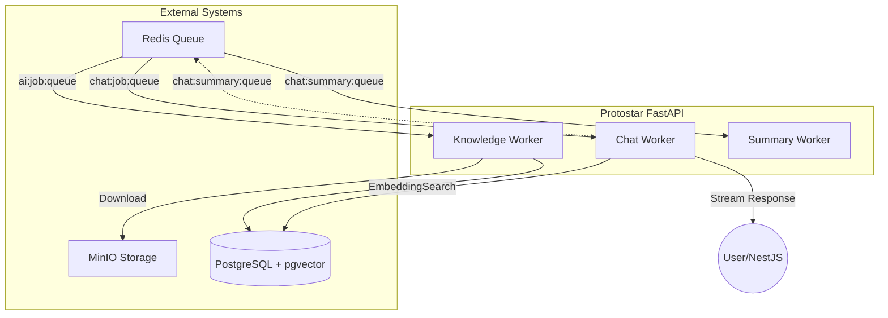

# Protostar FastAPI (AI Worker)

**Project Protostar**의 두뇌 역할을 담당하는 AI Worker 서비스다. 
비동기 작업 큐(Redis Queue)를 기반으로 고성능 AI 추론, RAG(Retrieval-Augmented Generation) 파이프라인, 그리고 데이터 요약 작업을 병렬로 처리하도록 구조화 되어있다. 

---

## 🏗 아키텍처 (Architecture)

본 프로젝트는 서비스의 안정성과 확장성을 위해 **멀티 워커(Multi-Worker) 구조**를 채택하고 있다.



### 🛠 핵심 구성 요소 (Core Components)

1.  **채팅 워커 (Chat Worker)**: 
    - `chat:job:queue`를 구독(Consume)하여 실시간 대화를 처리한다.
    - RAG를 통한 지식 검색 및 스트리밍 응답(Streaming Response)을 지원한다.
    - 해당 워커를 통해 사용자의 질문에 대한 답변을 생성하고, 이를 사용자에게 스트리밍으로 전달한다.
2.  **지식 워커 (Knowledge Worker)**: 
    - `ai:job:queue`를 구독하여 문서 벡터화 작업을 수행한다.
    - MinIO에서 파일을 가져와 텍스트 추출 -> 청킹(Chunking) -> 임베딩 -> DB 저장을 담당한다.
    - 해당 워커를 통해 문서의 내용을 벡터화하여 저장하고, 이를 통해 RAG를 구현한다.
3.  **요약 워커 (Summary Worker)**: 
    - `chat:summary:queue`를 구독하여 대화 내용을 배경에서 요약한다.
    - 다음 대화 시 컨텍스트(Context)를 효율적으로 관리할 수 있도록 돕는다.
    - 해당 워커를 통해 세션 당 기억력을 확보하고, 장기기 기억 시의 토큰 소비량을 약 73% 까지 압축하는 결과를 만들었다.

---

## 📂 프로젝트 구조 (Project Structure)

```
app/
├── core/
│   ├── worker.py    # Redis Queue 구독 및 이벤트 루프 처리
│   ├── ai.py        # 실제 AI 로직 (LLM 호출, 프롬프트 조합)
│   ├── database.py  # DB 연결 (필요 시)
│   └── redis.py     # Redis 연결 설정
├── prompts/         # 시스템 프롬프트 및 페르소나 관리
│   ├── system/
│   └── user_data/
├── main.py          # 앱 진입점
└── pyproject.toml   # 의존성 관리
```

---

## 🚀 시작하기 (Getting Started)

### 사전 요구사항 (Prerequisites)
- Python 3.10+
- `uv` (권장 패키지 매니저)
- Docker & Docker Compose
- Redis (필수)

### 설치 및 실행 (Installation & Run)

#### 1. 환경 설정
`init.env` 내용을 참고하여 `.env` 파일을 생성합니다.

```bash
# .env 예시
REDIS_HOST="localhost"
REDIS_PORT=6379
OPENAI_API_KEY="sk-..."
```

#### 2. 로컬 개발 모드 실행

```bash
# Docker Compose 기반 실행
docker compose up fastapi-dev
```

#### 3. 배포 
app 폴더 상위 루트는 production 을 위하여 준비된 구성입니다. 

---

## 🔗 관련 문서 (References)
- **AI Rules & Guide**: [docs/guide](../../docs/guide)
- **Architecture Note**: [ArchitectNote.md](../../docs/project-official/ArchitectNote.md)
- **API Specs**: [FastAPI Swagger](http://localhost:5860/docs) (로컬 실행 시)
